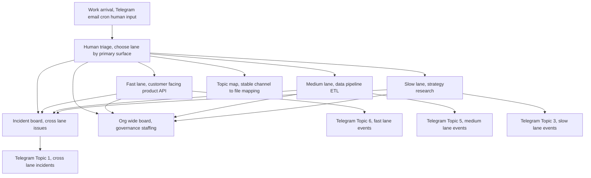
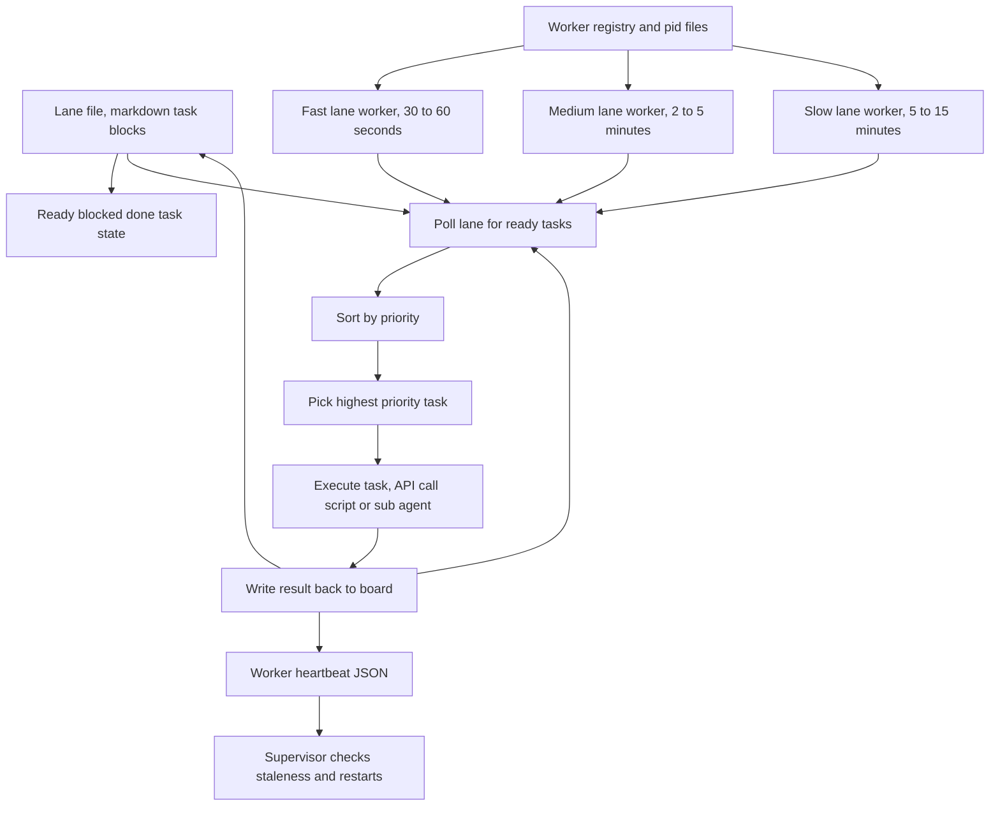
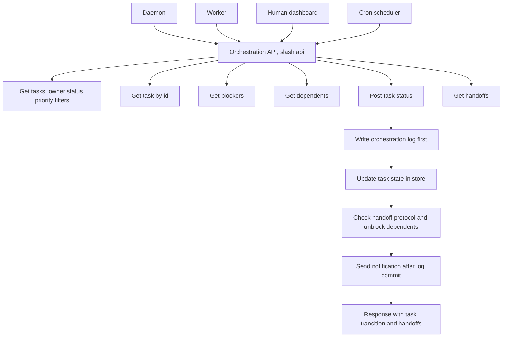
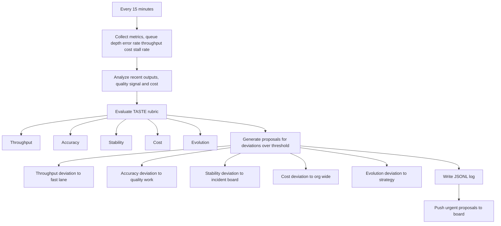
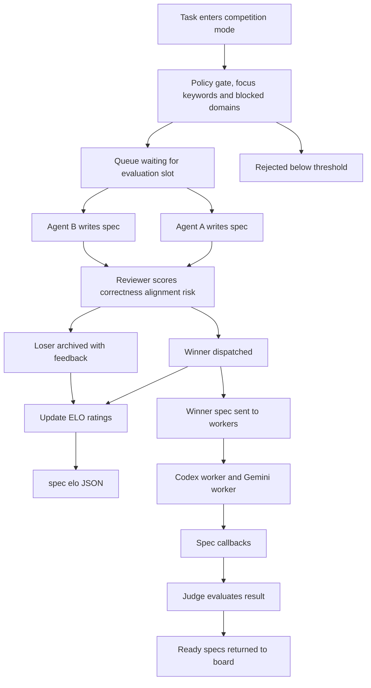

# Three-Layer Task Orchestration Pattern

A production-proven architecture for running multi-agent task execution with human oversight.

**Core principle:** Humans define what matters. Machines decide what moves next.

---

## The Problem

Most automation fails at the human/machine boundary:
- Machines execute but humans don't know what's happening
- Humans get involved too often, creating bottlenecks
- No clear contract for when machines can self-direct vs. when to escalate
- Tool sprawl: cron jobs, scripts, agents all running independently with no shared state

## The Solution

Three cleanly separated layers:

```
Layer 1: BOARD          Human-facing work intake, visibility, triage
Layer 2: ORCHESTRATION  Automated execution engine
Layer 3: DATA           Canonical sources, transforms, derived stores
```

**Key design rule:** Humans own what matters (policy, priorities, escalation). Machines own what moves (task picking, execution, retry, logging).

---

## Quick Start

```bash
# 1. Start the daemon
python3 examples/minimal_daemon.py

# 2. Watch the log
tail -f orchestration.log.jsonl
```

---

## Architecture Diagrams

### Full Architecture

```mermaid
graph TD
    B0[Layer 1 Board]
    B1[Human intake and triage]
    B2[Topic map, channel to file routing]
    B3[Fast lane, product API user facing]
    B4[Medium lane, data pipeline ETL]
    B5[Slow lane, strategy research]
    B6[Incident board, cross lane escalation]
    B7[Org wide board, governance staffing]

    O0[Layer 2 Orchestration]
    O1[Task loop daemon]
    O2[Pick next task, WIP 1, highest priority]
    O3[Execute task, run spawn dispatch]
    O4[Mark done or blocked, write log before notify]
    O5[Cron scheduler]
    O6[Collect metrics and analyze outputs]
    O7[Evaluate TASTE and generate proposals]
    O8[Spec competition]
    O9[Agent A and Agent B write specs]
    O10[Reviewer scores both and updates ELO]
    O11[Lane workers]
    O12[Fast worker, 30 to 60 seconds]
    O13[Medium worker, 2 to 5 minutes]
    O14[Slow worker, 5 to 15 minutes]

    D0[Layer 3 Data]
    D1[Canonical source, append only for consumers]
    D2[ETL and sync, schema validation]
    D3[Derived store, PostgreSQL or SQLite]

    L0[orchestration log JSONL, immutable append only]
    A0[Orchestration API]
    A1[Get tasks]
    A2[Get blockers and dependents]
    A3[Post task status, atomic log state handoff notify]
    A4[Get handoffs]

    B0 --> B1
    B1 --> B2
    B1 --> B3
    B1 --> B4
    B1 --> B5
    B1 --> B6
    B1 --> B7

    B0 --> O0
    O0 --> O1 --> O2 --> O3 --> O4
    O0 --> O5 --> O6 --> O7
    O0 --> O8 --> O9 --> O10
    O0 --> O11
    O11 --> O12
    O11 --> O13
    O11 --> O14

    O4 --> L0
    O7 --> L0

    O0 --> A0
    A0 --> A1
    A0 --> A2
    A0 --> A3
    A0 --> A4

    O0 --> D0
    D0 --> D1 --> D2 --> D3
    L0 --> B0
```



---

### Board Layer



### Lane Workers



### Orchestration API



### Cron Scheduler



### Spec Competition + ELO



---

## What's Included

| Path | Description |
|------|-------------|
| `docs/ARCHITECTURE.md` | Full architecture doc |
| `docs/SLA.md` | Lane-aware SLA/escalation matrix |
| `diagrams/*.mmd` | Mermaid source files |
| `examples/minimal_daemon.py` | Working skeleton daemon |
| `examples/task_schema.yaml` | Full task schema reference |
| `examples/schema.json` | JSONL orchestration log schema |
| `reference/` | Production-tested implementation patterns |

---

## When to Use This

**Good fits:**
- Multi-agent systems with shared task state
- Ops/runbook automation needing human escalation
- Data pipelines with freshness SLAs
- Any system where humans need visibility without constant involvement

**Bad fits:**
- Pure human workflows (use a kanban board)
- Real-time control systems (loop latency is too high)
- One-off scripts (overhead not worth it)

---

## Reference Implementation Layer

The `reference/` directory contains production-tested implementation patterns:

| File | Description |
|------|-------------|
| `reference/BOARD_LAYER.md` | Coordination boards, topic lanes, incident routing |
| `reference/LANE_WORKERS.md` | Per-lane background processor, startup supervisor, health checks |
| `reference/MC_API.md` | 5-endpoint REST API, atomicity contract, Flask implementation |
| `reference/CRON_ORCHESTRATOR.md` | 15-min scheduler, TASTE rubric, alert routing |
| `reference/SPEC_COMPETITION.md` | Multi-agent ELO rating system, reviewer rubric |

These are **reference patterns**, not drop-in implementations. Adapt to your stack.

---

## Status

Pattern is production-proven. Reference implementations are skeletons.

MIT License.
