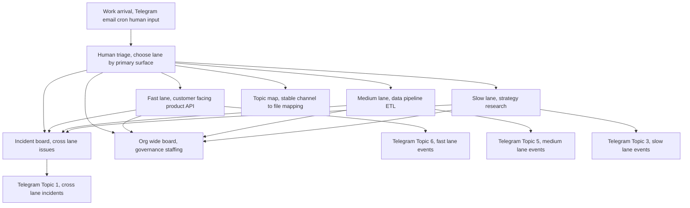

# Board Layer — Reference Implementation



The Board is the human-facing layer. This document describes a production implementation using markdown files as the task store, with Telegram (or any messaging platform) as the notification surface.

---

## Concept

The Board is a set of **coordination files** — one per lane — plus a shared **incident board** for cross-lane issues. Each file contains task blocks that are the canonical record of work.

```
coordination/
  README.md          ← routing rules, lane boundaries
  topic-map.md       ← lane → file mapping
  fast-lane.md       ← tasks: product, API, user-facing
  medium-lane.md     ← tasks: data, pipeline, ETL
  slow-lane.md       ← tasks: strategy, research
  incident-board.md  ← cross-lane incidents
  org-wide.md        ← governance, staffing
```

---

## Routing Rules

When work arrives (via Telegram message, email, cron alert, or human input):

1. **Choose the lane** based on the primary surface affected
2. **Append or update a task block** in that lane's file
3. **Keep cross-lane incidents** in `incident-board.md`

Lane boundaries:
- **Fast lane**: Customer-facing, revenue-critical, live surfaces
- **Medium lane**: Internal tooling, data, ops, ETL
- **Slow lane**: Strategy, research, positioning, knowledge work

If work spans lanes, use the fastest affected lane until ownership is clarified.

---

## Task Block Format

Tasks are embedded in coordination files as YAML frontmatter blocks:

```markdown
<!-- TASK id=LANE-001 uid=01KXXXXXXXXXXXXXXXX -->
```yaml
id: LANE-001
uid: 01KXXXXXXXXXXXXXXXX
title: Short description
status: in-progress
owner: lane-fast
priority: high
hours: 2
created: '2026-04-07T12:00:00Z'
updated: '2026-04-07T14:00:00Z'
started_at: '2026-04-07T13:00:00Z'
blockers:
  - id: LANE-000
    owner: lane-medium
    reason: Needs data pipeline running before this can start
    requiredOutcome: Pipeline delivering to store X
downstreamDependents:
  - LANE-002
handoffProtocol:
  from: lane-medium
  to: lane-fast
  trigger: status == done
  notification: "LANE-000 done. lane-fast: your dependency is resolved."
staledThreshold: 172800  # 48h in seconds
tags:
  - enrichment
  - api
description: |
  Longer description. What is this trying to accomplish?
  What does done look like?
```

---

## Incident Board

Cross-lane incidents get their own file. An incident is any issue that affects multiple lanes or doesn't have a clear single owner.

```yaml
id: INC-001
uid: 01KXXXXXXXXXXXXXXXX
title: Data pipeline degraded, affecting fast-lane surfaces
status: active
severity: critical
affectedLanes:
  - lane-fast
  - lane-medium
startedAt: '2026-04-07T10:00:00Z'
impact: Fast-lane API returning stale data. Medium-lane ETL blocked.
ownedBy: lane-medium
nextStep: Restart sync daemon, verify freshness < 5min
```

Severity levels:
- **Critical**: Customer-visible outage, broken core surface, corrupted data on active surface
- **High**: Major degradation, blocked execution on priority path
- **Medium**: Real defect, contained blast radius
- **Low**: Polish, non-urgent optimization

---

## Topic Map

A stable mapping between notification channels and coordination files:

```yaml
channels:
  - channel: telegram-topic-1
    name: Org-Wide
    file: org-wide.md
    lanes: [org-wide]
  - channel: telegram-topic-5
    name: Data/Pipeline
    file: medium-lane.md
    lanes: [lane-medium]
  - channel: telegram-topic-6
    name: Product/API
    file: fast-lane.md
    lanes: [lane-fast]
  - channel: telegram-topic-3
    name: Strategy
    file: slow-lane.md
    lanes: [lane-slow]
```

---

## Notification Routing

Each event type routes to a specific channel:

| Event | Destination |
|-------|-------------|
| Task stalled (motion window exceeded) | Lane owner channel |
| Data freshness incident | Medium lane channel |
| Product surface degraded | Fast lane channel |
| Cross-lane incident opened | Org-wide + lane channels |
| Task completed, dependency unblocked | Downstream owner channel |
| Escalation triggered | Org-wide channel |

---

## File Structure

```
coordination/
  README.md           ← routing rules, lane definitions
  topic-map.md        ← channel → file mapping
  fast-lane.md        ← fast lane tasks (product, API, user-facing)
  medium-lane.md      ← medium lane tasks (data, pipeline, ops)
  slow-lane.md        ← slow lane tasks (strategy, research)
  incident-board.md   ← cross-lane incidents
  org-wide.md         ← governance, staffing, cross-cutting
```

All files live in the same directory. The topic map is the index — don't rename files casually, they're workspace anchors.
