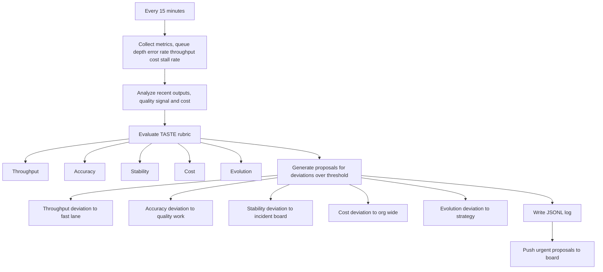

# Cron Orchestrator — Reference Implementation



The Cron Orchestrator is the observability and improvement layer. It runs on a fixed schedule (typically every 15 minutes) and does not execute tasks — it observes, evaluates, and proposes.

---

## Responsibilities

```
Every N minutes:
  1. Collect system metrics
  2. Analyze work outputs (quality, cost)
  3. Evaluate against quality rubric
  4. Generate improvement proposals
  5. Write to orchestration log
  6. Push proposals to Board (optional)
```

The Cron Orchestrator is the "window into the machine" for human operators. It answers: is the system healthy? Is anything degrading? Are costs under control?

---

## Implementation Skeleton (Node.js / JavaScript)

```javascript
#!/usr/bin/env node
/**
 * Cron Orchestrator
 * Runs every 15 minutes.
 * Does NOT execute tasks — observes and proposes.
 */

const fs = require('fs');
const path = require('path');
const { execSync } = require('child_process');
const LOG_DIR = path.join(__dirname, '../../logs');

// ── Logging ────────────────────────────────────────────────
function logAction(action, data) {
    const entry = {
        ts: new Date().toISOString(),
        action,
        ...data,
    };
    const logFile = path.join(LOG_DIR, 'cron-orchestrator.log');
    fs.appendFileSync(logFile, JSON.stringify(entry) + ' - ');
    console.log(`[cron] ${action}:`, JSON.stringify(data));
}

// ── Step 1: Collect Metrics ────────────────────────────────
function collectMetrics() {
    try {
        const output = execSync('bash collect-metrics.sh', { encoding: 'utf8' });
        return JSON.parse(output);
    } catch (err) {
        logAction('METRICS_ERROR', { error: err.message });
        return null;
    }
}

// ── Step 2: Analyze Outputs ───────────────────────────────
function analyzeOutputs(metrics) {
    // Analyze recent task results for quality signals
    // and recent transcripts for cost categorization
    try {
        const output = execSync('python3 analyze-recent-runs.py', { encoding: 'utf8' });
        return JSON.parse(output);
    } catch (err) {
        return { status: 'SKIP', reason: err.message };
    }
}

// ── Step 3: Evaluate Against Rubric ───────────────────────
function evaluate(metrics, analysis) {
    // TASTE rubric evaluation:
    // Throughput — is work moving?
    // Accuracy — are tasks being completed correctly?
    // Stability — is error rate acceptable?
    // Cost — is spend within budget?
    // Evolution — is the system improving?

    if (!metrics) return null;

    return {
        throughput: evaluate_throughput(metrics),
        accuracy: evaluate_accuracy(metrics),
        stability: evaluate_stability(metrics),
        cost: evaluate_cost(metrics),
        evolution: evaluate_evolution(analysis),
    };
}

// ── Step 4: Generate Proposals ────────────────────────────
function generateProposals(evaluation) {
    const proposals = [];

    for (const [dimension, score] of Object.entries(evaluation)) {
        if (score.deviation > THRESHOLD) {
            proposals.push({
                dimension,
                deviation: score.deviation,
                recommendation: score.recommendation,
                urgency: score.urgency,
            });
        }
    }

    return proposals;
}

// ── Step 5: Write Log ────────────────────────────────────
function logCycle(metrics, evaluation, proposals) {
    logAction('CYCLE_COMPLETE', {
        metrics,
        evaluation,
        proposals_generated: proposals.length,
        proposals,
    });
}

// ── Step 6: Push to Board (optional) ─────────────────────
function pushToBoard(proposals) {
    for (const proposal of proposals) {
        if (proposal.urgency === 'high') {
            // Write proposal to board as escalated task
            execSync(`python3 create-escalation-task.py --proposal='${JSON.stringify(proposal)}'`);
        }
    }
}

// ── Main ──────────────────────────────────────────────────
const CHECK_INTERVAL = 15 * 60 * 1000; // 15 minutes

async function runCycle() {
    console.log('[cron] Starting cycle...');
    const metrics = collectMetrics();
    const analysis = analyzeOutputs(metrics);
    const evaluation = evaluate(metrics, analysis);
    const proposals = generateProposals(evaluation);
    logCycle(metrics, evaluation, proposals);
    if (proposals.length > 0) {
        pushToBoard(proposals);
    }
}

// Schedule: run every N minutes
setInterval(runCycle, CHECK_INTERVAL);
runCycle(); // run immediately on start
```

---

## Metrics to Collect

| Metric | What it measures | How to collect |
|--------|-----------------|----------------|
| Queue depth | Backlog pressure | Count tasks by status |
| Error rate | Task failure frequency | Count failed tasks / total |
| Throughput | Tasks completed per hour | Count `done` events in last hour |
| Avg duration | Task execution time | Mean of `duration_ms` for done tasks |
| Cost per task | API spend per task | Sum token costs from logs |
| Stall rate | Tasks exceeding SLA | Count `escalated` events |
| Blocked ratio | Dependency friction | Count `blocked` tasks |

---

## TASTE Rubric

A five-dimension quality framework for evaluating system health:

| Dimension | Measures | Signal |
|-----------|---------|--------|
| **T**hroughput | Work moving through system? | Tasks done/hour |
| **A**ccuracy | Tasks completed correctly? | Pass rate on judged tasks |
| **S**tability | Error rate within tolerance? | Failure rate < threshold |
| **C**ost | Spend within budget? | Cost/task vs budget |
| **E**volution | System improving over time? | Trend on all metrics |

Each dimension gets a score 0-100 and a deviation from baseline. If deviation exceeds threshold (e.g., 20%), generate a proposal.

---

## Default Thresholds

```yaml
thresholds:
  throughput:
    min: 2          # tasks/hour minimum
    alert: 1        # alert if below this
  accuracy:
    min: 0.80       # 80% minimum pass rate
    alert: 0.70     # alert if below this
  stability:
    max_error_rate: 0.10   # 10% max error rate
    alert: 0.20           # alert if above this
  cost:
    max_per_task: 0.50    # $0.50 max per task
    alert: 1.00           # alert if above this
  evolution:
    window: 7d            # compare to 7-day baseline
    min_improvement: 0.05  # 5% improvement expected
```

---

## Alert Routing

Proposals route based on urgency and dimension:

| Dimension | Urgency | Destination |
|-----------|---------|-------------|
| Throughput | High | Fast-lane board |
| Accuracy | High | Quality board |
| Stability | Critical | Incident board + fast-lane |
| Cost | Medium | Org-wide |
| Evolution | Low | Strategy board |
