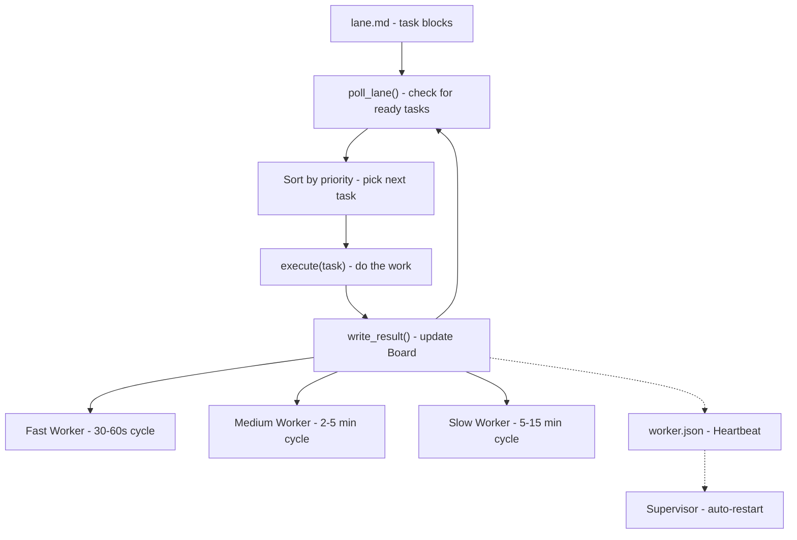

# Lane Workers — Reference Implementation



A lane worker is a background process dedicated to a single coordination lane. Each worker watches its lane for new work, executes tasks, and writes results back to the Board.

---

## Pattern

```
while True:
    task = lane.poll()        # check lane file for ready tasks
    if task is None:
        sleep(POLL_INTERVAL) # back off
        continue

    result = execute(task)    # do the work
    lane.write_result(task, result)  # write to coordination board
    sleep(POLL_INTERVAL)
```

Workers are **dumb and focused** — they own one lane, they do one type of work, and they don't make cross-lane decisions.

---

## Worker Skeleton

```python
#!/usr/bin/env python3
"""Lane Worker — minimal skeleton"""
import time, json, sys
from pathlib import Path

LANE_FILE = Path("coordination/fast-lane.md")
POLL_INTERVAL = 60  # seconds

def poll_lane():
    """Read lane file, return next ready task or None."""
    content = LANE_FILE.read_text()
    # Parse task blocks from markdown
    tasks = parse_task_blocks(content)
    ready = [t for t in tasks if t["status"] == "ready"]
    if not ready:
        return None
    # Return highest priority
    ready.sort(key=lambda t: PRIO.get(t["priority"], 99))
    return ready[0]

def execute(task):
    """Execute a task. Returns dict with ok/result/error."""
    print(f"[worker] Executing {task['id']}: {task['title']}")
    # ── INSERT YOUR WORK HERE ────────────────────────────
    # Examples:
    #   result = call_api(task)
    #   result = run_script(task)
    #   result = spawn_subagent(task)
    # ────────────────────────────────────────────────────
    return {"ok": True, "result": "done"}

def write_result(task, result):
    """Update task block in lane file."""
    content = LANE_FILE.read_text()
    # Replace task block with updated status
    updated = update_task_block(content, task["id"], {
        "status": "done" if result["ok"] else "failed",
        "updated": iso_now(),
    })
    LANE_FILE.write_text(updated)
    print(f"[worker] {task['id']} -> {'done' if result['ok'] else 'failed'}")

def run():
    print(f"[worker] Starting. Watching {LANE_FILE}. Poll every {POLL_INTERVAL}s.")
    while True:
        task = poll_lane()
        if task:
            result = execute(task)
            write_result(task, result)
        else:
            time.sleep(POLL_INTERVAL)

if __name__ == "__main__":
    run()
```

---

## Worker Registry

Track all workers in a registry for observability:

```yaml
# workers/registry.yaml
workers:
  - name: fast-lane
    lane: fast-lane.md
    script: workers/fast_lane_worker.py
    pid_file: workers/.fast-lane.pid
    poll_interval: 60
    active: true

  - name: medium-lane
    lane: medium-lane.md
    script: workers/medium_lane_worker.py
    pid_file: workers/.medium-lane.pid
    poll_interval: 120
    active: true

  - name: slow-lane
    lane: slow-lane.md
    script: workers/slow_lane_worker.py
    pid_file: workers/.slow-lane.pid
    poll_interval: 300
    active: true
```

---

## Health Checks

Each worker writes a heartbeat:

```json
{
  "ts": "2026-04-07T12:00:00Z",
  "worker": "fast-lane",
  "pid": 12345,
  "status": "running",
  "last_task": "LANE-001",
  "last_result": "done"
}
```

A supervisor cron checks heartbeats every 15 minutes. If a worker hasn't heartbeat in N minutes (where N > poll interval), restart it.

---

## Worker Types

### Fast-Lane Workers
- **Poll interval**: 30-60s
- **Examples**: API surface monitor, product defect responder, /explore page builder

### Medium-Lane Workers
- **Poll interval**: 2-5min
- **Examples**: Data pipeline monitor, ETL sync worker, Phantom DB scraper

### Slow-Lane Workers
- **Poll interval**: 5-15min
- **Examples**: Strategy brief generator, partner queue scanner, research aggregator

---

## Common Worker Patterns

### Pattern 1: API Builder
Responds to tasks that require building an API endpoint or feature:
```python
def execute(task):
    spec = task["description"]
    code = generate_code(spec)  # call LLM
    write_file(task["output_path"], code)
    return {"ok": True, "result": f"Wrote {task['output_path']}"}
```

### Pattern 2: ETL Worker
Responds to data pipeline tasks:
```python
def execute(task):
    run_etl(task["pipeline_id"])
    verify_freshness(task["store"])
    return {"ok": True, "result": "ETL complete, freshness verified"}
```

### Pattern 3: Brief Writer
Responds to strategy or analysis tasks:
```python
def execute(task):
    brief = generate_brief(task["topic"], task["sources"])
    save_brief(task["output_path"], brief)
    return {"ok": True, "result": f"Brief saved to {task['output_path']}"}
```

---

## Startup Script

```bash
#!/bin/bash
# workers/supervisor.sh — starts and keeps all workers alive
set -e

WORKERS=(
    "workers/fast_lane_worker.py"
    "workers/medium_lane_worker.py"
    "workers/slow_lane_worker.py"
)

for worker in "${WORKERS[@]}"; do
    name=$(basename "$worker" .py)
    pidfile="workers/.${name}.pid"

    if [ -f "$pidfile" ] && kill -0 "$(cat $pidfile)" 2>/dev/null; then
        echo "$name already running (PID $(cat $pidfile))"
    else
        echo "Starting $name..."
        nohup python3 "$worker" >> "logs/${name}.log" 2>&1 &
        echo $! > "$pidfile"
    fi
done
```
