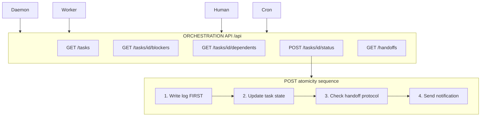

# Orchestration API — Reference Implementation



A lightweight REST API for task coordination. Every state mutation writes the orchestration log first, then updates task state, then fires notifications.

Base URL: `http://localhost:3000/api`

---

## Endpoints

### `GET /api/tasks`

List tasks with optional filters.

**Query params:**
| Param | Description |
|-------|-------------|
| `owner` | Filter by owner (e.g., `lane-fast`) |
| `status` | Filter by status (`backlog`, `ready`, `in-progress`, `blocked`, `done`, `escalated`) |
| `priority` | Filter by priority (`critical`, `high`, `medium`, `low`) |
| `limit` | Max results (default 50) |
| `offset` | Pagination offset |

**Response:**
```json
{
  "tasks": [
    {
      "id": "LANE-001",
      "title": "Build /explore endpoint",
      "status": "in-progress",
      "owner": "lane-fast",
      "priority": "high",
      "created": "2026-04-07T12:00:00Z",
      "updated": "2026-04-07T14:00:00Z"
    }
  ],
  "total": 42,
  "limit": 50,
  "offset": 0
}
```

---

### `GET /api/tasks/{id}`

Get a single task with full details.

**Response:**
```json
{
  "id": "LANE-001",
  "title": "Build /explore endpoint",
  "status": "in-progress",
  "owner": "lane-fast",
  "priority": "high",
  "blockers": [
    {
      "id": "LANE-000",
      "owner": "lane-medium",
      "reason": "Needs data pipeline running",
      "resolved": false
    }
  ],
  "downstreamDependents": ["LANE-002", "LANE-003"],
  "handoffProtocol": {
    "from": "lane-medium",
    "to": "lane-fast",
    "trigger": "status == done",
    "notification": "LANE-000 done. lane-fast: dependency resolved."
  },
  "staledThreshold": 172800,
  "startedAt": "2026-04-07T13:00:00Z",
  "updatedAt": "2026-04-07T14:00:00Z"
}
```

---

### `GET /api/tasks/{id}/blockers`

Get all blocking tasks for a given task with enriched status.

**Response:**
```json
{
  "task": "LANE-001",
  "blockers": [
    {
      "id": "LANE-000",
      "status": "in-progress",
      "owner": "lane-medium",
      "reason": "Needs data pipeline running",
      "requiredOutcome": "Pipeline delivering to store",
      "progress": "ETL running, 80% complete",
      "estimatedCompletion": "2026-04-07T15:00:00Z"
    }
  ],
  "allResolved": false
}
```

---

### `GET /api/tasks/{id}/dependents`

Get all downstream tasks waiting on this task.

**Response:**
```json
{
  "task": "LANE-000",
  "dependents": [
    {
      "id": "LANE-001",
      "status": "blocked",
      "owner": "lane-fast",
      "priority": "high",
      "criticalPath": true
    },
    {
      "id": "LANE-002",
      "status": "blocked",
      "owner": "lane-fast",
      "priority": "medium",
      "criticalPath": false
    }
  ],
  "criticalPathCount": 1
}
```

---

### `POST /api/tasks/{id}/status`

Update task status. **This is the main write endpoint.**

**Request:**
```json
{
  "status": "done",
  "owner": "lane-fast",
  "reason": "Build complete, all tests passing"
}
```

**Side effects (in order):**
1. **Write orchestration log entry** (BEFORE any other action)
2. **Update task status** in task store
3. **Check handoff protocol** — if `status == done` and task has downstream dependents, update their status to `ready`
4. **Send notification** to downstream owner channel

**Response:**
```json
{
  "task": "LANE-001",
  "from": "in-progress",
  "to": "done",
  "handoffs_triggered": ["LANE-002"],
  "notifications_sent": 1
}
```

---

### `GET /api/orchestration/handoffs`

View pending and recent orchestration events.

**Response:**
```json
{
  "handoffs": [
    {
      "task": "LANE-001",
      "from": "lane-medium",
      "to": "lane-fast",
      "trigger": "done",
      "ts": "2026-04-07T15:00:00Z"
    }
  ],
  "recent": [
    {
      "task": "LANE-002",
      "from": "blocked",
      "to": "ready",
      "unblocked_by": "LANE-001",
      "ts": "2026-04-07T15:00:01Z"
    }
  ],
  "escalations": []
}
```

---

## Atomicity Contract

All status updates follow this order:

```
1. Write log entry  ← ALWAYS first
2. Update task state
3. Check handoff protocol
4. Send notifications
```

If step 4 fails (Telegram down, webhook blocked), steps 1-3 are already committed. The log is the source of truth. Notifications are best-effort.

---

## Implementation (Python/Flask)

```python
from flask import Flask, request, jsonify
import json, time
from pathlib import Path

app = Flask(__name__)
TASKS_FILE = Path("tasks.json")
LOG_FILE = Path("orchestration.log.jsonl")

def write_log(task_id, from_state, to_state, actor, **kwargs):
    """Write log entry FIRST — before any state change."""
    entry = {
        "ts": iso_now(),
        "task": task_id,
        "from": from_state,
        "to": to_state,
        "actor": actor,
        **kwargs,
    }
    with open(LOG_FILE, "a") as f:
        f.write(json.dumps(entry) + " - ")
    return entry

@app.post("/api/tasks/<task_id>/status")
def update_status(task_id):
    data = request.json
    tasks = json.loads(TASKS_FILE.read_text())

    if task_id not in tasks:
        return jsonify({"error": "not found"}), 404

    task = tasks[task_id]
    old_status = task["status"]

    # Step 1: Write log (BEFORE state change)
    write_log(task_id, old_status, data["status"], "api")

    # Step 2: Update state
    task["status"] = data["status"]
    task["updatedAt"] = iso_now()
    if data["status"] == "in-progress":
        task["startedAt"] = iso_now()
    TASKS_FILE.write_text(json.dumps(tasks, indent=2))

    # Step 3: Check handoffs
    handoffs = []
    if data["status"] == "done" and task.get("downstreamDependents"):
        for dep_id in task["downstreamDependents"]:
            if dep_id in tasks and tasks[dep_id]["status"] == "blocked":
                write_log(dep_id, "blocked", "ready", "orchestrator", unblocked_by=task_id)
                tasks[dep_id]["status"] = "ready"
                handoffs.append(dep_id)
        TASKS_FILE.write_text(json.dumps(tasks, indent=2))

    # Step 4: Notifications (best-effort, after log is committed)
    send_notifications(task_id, handoffs)

    return jsonify({
        "task": task_id,
        "from": old_status,
        "to": data["status"],
        "handoffs_triggered": handoffs,
    })
```
