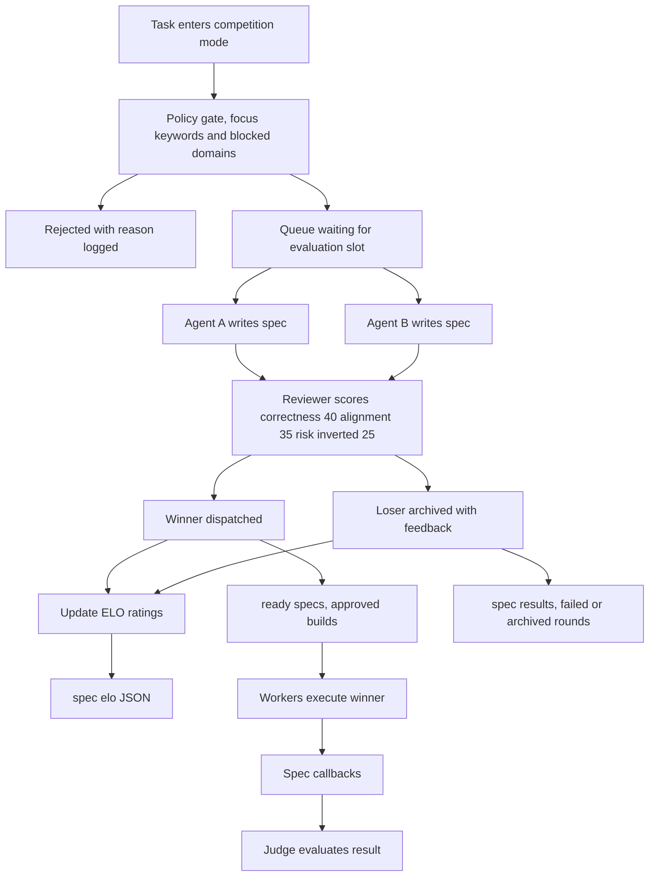

# Spec Competition + ELO Rating System



When a task requires a decision — which approach to take, which model to use, which design to implement — the Spec Competition mode runs multiple agents in parallel and picks the winner by scoring.

---

## Flow

```
Task enters competition
        │
        ▼
  ┌─────────────┐
  │ Policy gate │  Does it pass focus/block thresholds?
  └──────┬──────┘
         │ pass
         ▼
  ┌─────────────┐
  │ Queue       │  Wait for evaluation slot (max_batch)
  └──────┬──────┘
         │
         ▼
  ┌─────────────┐     ┌─────────────┐
  │ Agent A     │     │ Agent B     │
  │ (model X)   │     │ (model Y)   │
  │ writes spec │     │ writes spec │
  └──────┬──────┘     └──────┬──────┘
         │                   │
         ▼                   ▼
  ┌─────────────────────────────────┐
  │         Reviewer scores both     │
  │   (quality × alignment × risk)  │
  └───────────────┬─────────────────┘
                  │
         ┌────────┴────────┐
         ▼                 ▼
    ┌─────────┐      ┌─────────┐
    │ Winner  │      │ Loser   │
    │ ELO +N  │      │ ELO -N  │
    └────┬────┘      └────┬────┘
         │                │
         ▼                ▼
  Dispatch to       Archive spec
  workers          with feedback
```

---

## ELO Rating System

Each agent has an ELO rating. When two agents compete, the winner gains ELO points, the loser loses them.

**Starting rating:** 1200  
**K-factor:** 32 (higher = faster adjustment)  
**Expected score:** `E = 1 / (1 + 10^((rating_B - rating_A) / 400))`

```python
def update_elo(winner_rating, loser_rating, k=32):
    E_winner = 1 / (1 + 10 ** ((loser_rating - winner_rating) / 400))
    E_loser  = 1 / (1 + 10 ** ((winner_rating - loser_rating) / 400))

    new_winner = winner_rating + k * (1 - E_winner)
    new_loser  = loser_rating  + k * (0 - E_loser)

    return round(new_winner), round(new_loser)

# Example: 1400 beats 1200
update_elo(1400, 1200)
# Winner: 1416 (+16), Loser: 1184 (-16)
```

---

## ELO Ratings File

```json
{
  "agents": {
    "codex-gpt54": {
      "rating": 1416,
      "wins": 23,
      "losses": 11,
      "draws": 2,
      "last_match": "2026-04-07T12:00:00Z"
    },
    "gemini-25pro": {
      "rating": 1384,
      "wins": 18,
      "losses": 14,
      "draws": 1,
      "last_match": "2026-04-07T12:00:00Z"
    }
  },
  "updated_at": "2026-04-07T12:00:00Z"
}
```

---

## Spec Format

Each agent writes a spec:

```yaml
spec:
  id: SPEC-001
  competition: COMP-001
  agent: codex-gpt54
  rating_before: 1400

  approach: |
    Use a corridor-based routing algorithm.
    Pre-compute navigation mesh from map data.
    Route around surveillance zones via A* on the mesh.

  estimated_cost: low        # low | medium | high
  estimated_risk: low       # low | medium | high
  estimated_time: 4h        # human-readable estimate
  testable_claims:
    - "Routes around all known ALPR zones"
    - "No loops on 1000 random routes tested"
    - "Average detour < 15%"

  alignment_with_requirements: high  # high | medium | low
  novelty: medium                    # high | medium | low
```

---

## Reviewer Scoring Rubric

The reviewer scores each spec 0-100 on three dimensions:

| Dimension | Weight | What it measures |
|-----------|--------|-----------------|
| **Correctness** | 40% | Does the approach solve the problem? Are the claims testable and likely true? |
| **Alignment** | 35% | Does it match the task requirements and constraints? |
| **Risk** | 25% | Cost, time, complexity, failure modes |

```python
def score_spec(spec, reviewer_output):
    correctness = reviewer_output.correctness   # 0-100
    alignment   = reviewer_output.alignment    # 0-100
    risk        = reviewer_output.risk         # 0-100

    # Invert risk (lower risk = higher score)
    risk_score = 100 - risk

    final = (
        0.40 * correctness +
        0.35 * alignment +
        0.25 * risk_score
    )
    return round(final, 1)
```

---

## Competition Round File

```json
{
  "id": "COMP-001",
  "task_id": "LANE-010",
  "created_at": "2026-04-07T10:00:00Z",
  "agents": ["codex-gpt54", "gemini-25pro"],
  "specs": {
    "codex-gpt54": { "spec_id": "SPEC-001A", "score": 84.2 },
    "gemini-25pro": { "spec_id": "SPEC-001B", "score": 79.7 }
  },
  "winner": "codex-gpt54",
  "winner_score": 84.2,
  "elos": {
    "codex-gpt54": { "before": 1400, "after": 1416 },
    "gemini-25pro": { "before": 1384, "after": 1368 }
  },
  "dispatch_id": "DISPATCH-001"
}
```

---

## Routing by ELO

Future task dispatch can use ELO to route to the best agent:

```python
def best_agent_for(task_type, agents_elo):
    """Pick agent with highest ELO for this task type."""
    # Filter to agents that can handle this task type
    eligible = [a for a in agents_elo if a.task_types.contains(task_type)]
    # Sort by rating descending
    eligible.sort(key=lambda a: a.rating, reverse=True)
    return eligible[0] if eligible else None
```

Or probabilistic selection weighted by ELO:

```python
import random

def weighted_random_agent(agents_elo):
    """Pick agent with probability proportional to ELO."""
    total = sum(a.rating for a in agents_elo)
    r = random.random() * total
    cumulative = 0
    for agent in agents_elo:
        cumulative += agent.rating
        if r <= cumulative:
            return agent
    return agents_elo[-1]
```

---

## When to Use Spec Competition

Spec competition adds significant overhead (2x agent runs per decision). Use it when:

- The task has high stakes (wrong approach = significant rework)
- Multiple reasonable approaches exist
- Agent quality varies significantly
- You want to build ELO data for future routing

Don't use it for:
- Routine tasks with obvious best approach
- Low-stakes decisions
- Time-critical work (competition adds 2-5 minutes)
